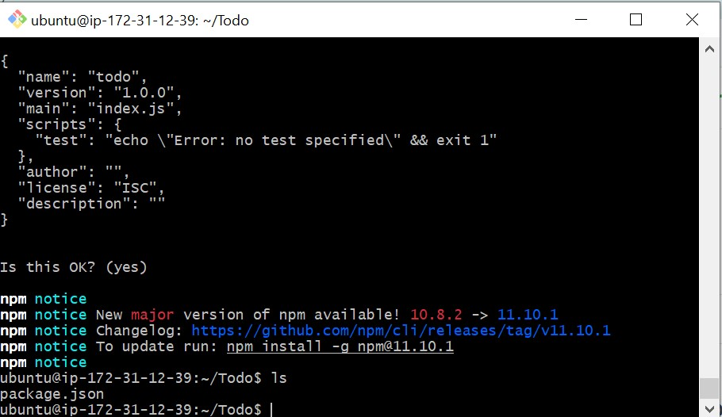
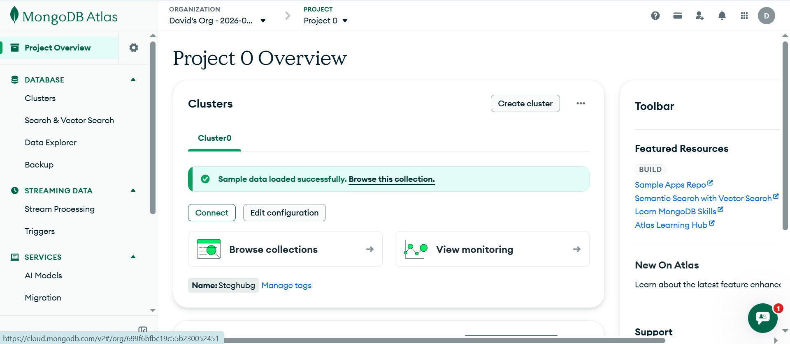
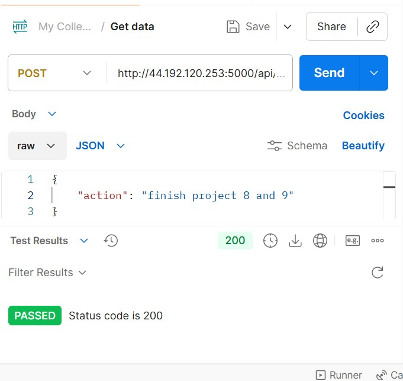
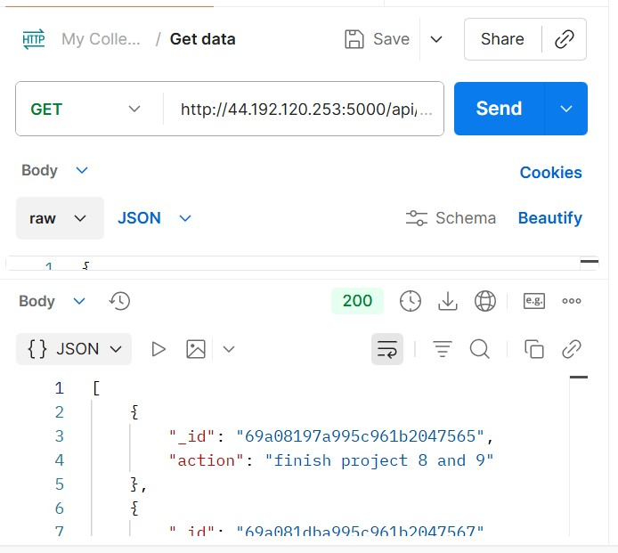
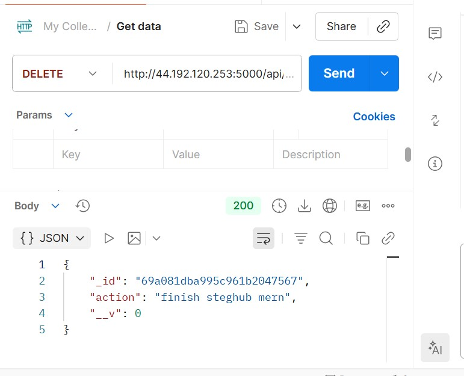
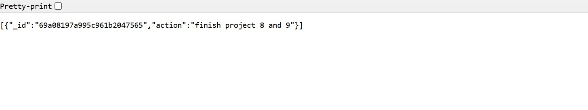
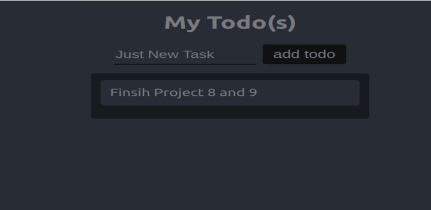

# MERN Stack Todo Application

A full-stack Todo application built with the MERN stack (MongoDB Atlas, Express.js, React, Node.js), deployed on an Ubuntu EC2 instance.

---

## Table of Contents

1. [Project Overview](#project-overview)
2. [Prerequisites](#prerequisites)
3. [Step 1 – Backend Configuration](#step-1--backend-configuration)
   - [System Setup](#system-setup)
   - [Node.js Installation](#nodejs-installation)
   - [Application Code Setup](#application-code-setup)
   - [ExpressJS Installation](#expressjs-installation)
   - [Models & Mongoose](#models--mongoose)
   - [MongoDB Atlas Database](#mongodb-atlas-database)
   - [Testing Backend with Postman](#testing-backend-with-postman)
4. [Step 2 – Frontend Creation](#step-2--frontend-creation)
   - [Scaffold React App](#scaffold-react-app)
   - [Configure Proxy & Scripts](#configure-proxy--scripts)
   - [React Components](#react-components)
5. [API Endpoints](#api-endpoints)
6. [Screenshots](#screenshots)

---

## Project Overview

This application allows users to manage a list of tasks through a browser interface. The React frontend communicates with an Express REST API, which reads and writes data to a cloud-hosted MongoDB Atlas database.

| Layer | Technology | Role |
|-------|-----------|------|
| **M**ongoDB | MongoDB Atlas | Cloud NoSQL database |
| **E**xpress.js | Express 4.x | REST API & routing |
| **R**eact | React 18.x | Frontend UI |
| **N**ode.js | Node.js 18.x | JavaScript runtime |

**Supported operations:**
-  Display all tasks — `HTTP GET`
-  Add a new task — `HTTP POST`
-  Delete an existing task — `HTTP DELETE`

---

## Prerequisites

- Ubuntu EC2 instance (with SSH access)
- MongoDB Atlas account (free tier)
- Postman installed locally
- Port `5000` and `3000` open in EC2 Security Group inbound rules

---

## Step 1 – Backend Configuration

### System Setup

Start by updating and upgrading the Ubuntu package list to ensure all system packages are current before installing new software.

```bash
# Update package list
sudo apt update

# Upgrade installed packages
sudo apt upgrade
```

### Node.js Installation

Node.js 18.x is installed from the official NodeSource repository to ensure we get a stable LTS version rather than the outdated version available in Ubuntu's default repositories.

```bash
# Fetch the Node.js 18.x setup script from NodeSource
curl -fsSL https://deb.nodesource.com/setup_18.x | sudo -E bash -

# Install Node.js (this also installs npm)
sudo apt-get install -y nodejs
```

> **Note:** The command above installs both `nodejs` and `npm`. NPM is a package manager for Node.js — similar to `apt` for Ubuntu — and is used to install Node modules, packages, and manage dependency conflicts.

```bash
# Verify Node.js installation
node -v

# Verify npm installation
npm -v
```
### Application Code Setup

```bash
# Create the project directory
mkdir Todo

# Confirm the directory was created
ls

# Change into the Todo directory
cd Todo

# Initialise the project (creates package.json)
npm init
```

> Follow the prompts after `npm init`. You can press **Enter** to accept defaults for each field, then type `yes` when asked to write the `package.json` file.

```bash
# Confirm package.json was created
ls
```

#### 📸 Screenshot – Terminal: `npm init` and `package.json` Created
> _Should show the `npm init` prompts being accepted in the terminal, followed by `ls` output confirming `package.json` is present in the `Todo` directory._



---

### ExpressJS Installation

Express is a framework for Node.js that simplifies route definition, HTTP method handling, and many other low-level details of building a web server.

```bash
# Install Express
npm install express

# Create the main server entry file
touch index.js

# Confirm index.js was created
ls

# Install the dotenv module (for environment variables)
npm install dotenv
```

Open `index.js` and add the initial server code:

```bash
vim index.js
```

```javascript
// index.js
const express = require('express');
require('dotenv').config();

const app = express();
const port = process.env.PORT || 5000;

app.use((req, res, next) => {
  res.header("Access-Control-Allow-Origin", "*");
  res.header("Access-Control-Allow-Headers", "Origin, X-Requested-With, Content-Type, Accept");
  next();
});

app.use((req, res, next) => {
  res.send('Welcome to Express');
});

app.listen(port, () => {
  console.log(`Server running on port ${port}`)
});
```

> Use `:w` to save and `:qa` to exit vim.

```bash
# Start the server to confirm it works
node index.js
```

Now open **port 5000** in your EC2 Security Group inbound rules (the same way TCP port 80 was opened for Nginx), then test in a browser:

```
http://<PublicIP-or-PublicDNS>:5000
```

### Routes

Create a `routes` directory and an `api.js` file to define the application's API endpoints:

```bash
mkdir routes && cd routes && touch api.js
vim api.js
```

```javascript
// routes/api.js
const express = require('express');
const router = express.Router();
const Todo = require('../models/todo');

router.get('/todos', (req, res, next) => {
  Todo.find({}, 'action')
    .then(data => res.json(data))
    .catch(next);
});

router.post('/todos', (req, res, next) => {
  if (req.body.action) {
    Todo.create(req.body)
      .then(data => res.json(data))
      .catch(next);
  } else {
    res.json({ error: "The input field is empty" });
  }
});

router.delete('/todos/:id', (req, res, next) => {
  Todo.findOneAndDelete({ _id: req.params.id })
    .then(data => res.json(data))
    .catch(next);
});

module.exports = router;
```

---

### Models & Mongoose

MongoDB is a NoSQL database, so instead of tables and rows it uses collections and documents. A **Mongoose schema** defines the structure of those documents.

```bash
# Go back to the Todo root directory
cd ..

# Install Mongoose
npm install mongoose

# Create the models folder, navigate into it, and create the schema file
mkdir models && cd models && touch todo.js

# Open the file
vim todo.js
```

```javascript
// models/todo.js
const mongoose = require('mongoose');
const Schema = mongoose.Schema;

// Create schema for todo
const TodoSchema = new Schema({
  action: {
    type: String,
    required: [true, 'The todo text field is required']
  }
});

// Create model for todo
const Todo = mongoose.model('todo', TodoSchema);

module.exports = Todo;
```

### MongoDB Atlas Database

Instead of a local MongoDB installation, this project uses **MongoDB Atlas** — a fully managed cloud database service. The free M0 tier is sufficient for this application.

#### Setting Up MongoDB Atlas

1. Sign up or log in at [cloud.mongodb.com](https://cloud.mongodb.com)
2. Click **"Build a Database"** → Select the **Free (M0)** tier
3. Choose **AWS** as the cloud provider and select a region near you
4. Name your cluster (e.g., `TodoCluster`) and click **Create**

#### 📸 Screenshot 7 – MongoDB Atlas: Cluster Dashboard
> _Should show the Atlas dashboard with your cluster listed and a green **"Active"** status, confirming the cluster is running._



#### Configure Network Access

In Atlas, navigate to **Network Access → Add IP Address**:

- For this project, allow access from anywhere: `0.0.0.0/0`
- **Important:** Set the expiry to **1 Week** (not the default 6 Hours) to avoid losing access mid-project


#### Create a Database User

Navigate to **Database Access → Add New Database User**:

```
Username: todoadmin
Password: <your secure password>
Role:     Read and Write to Any Database
```

#### Connect the App to Atlas

Get your connection string from Atlas by clicking **Connect → Connect your application**, then:

```bash
# In the Todo root directory, create the .env file
touch .env
vi .env
```

Add your Atlas connection string:

```env
DB = 'mongodb+srv://<username>:<password>@<cluster-address>/<dbname>?retryWrites=true&w=majority'
```

> Replace `<username>`, `<password>`, `<cluster-address>`, and `<dbname>` with your actual Atlas credentials.
> ⚠️ **Never commit `.env` to GitHub.** Add it to `.gitignore`.

Now update `index.js` to connect to MongoDB Atlas using the `.env` variable:

```bash
vim index.js
# Press esc, type :, then %d and Enter to clear the file, then press i to insert
```

```javascript
// index.js (updated)
const express = require('express');
const bodyParser = require('body-parser');
const mongoose = require('mongoose');
const routes = require('./routes/api');
const path = require('path');
require('dotenv').config();

const app = express();
const port = process.env.PORT || 5000;

// Connect to the database
mongoose.connect(process.env.DB, { useNewUrlParser: true, useUnifiedTopology: true })
  .then(() => console.log(`Database connected successfully`))
  .catch(err => console.log(err));

// Since mongoose's Promise is deprecated, we override it with Node's Promise
mongoose.Promise = global.Promise;

app.use((req, res, next) => {
  res.header("Access-Control-Allow-Origin", "*");
  res.header("Access-Control-Allow-Headers", "Origin, X-Requested-With, Content-Type, Accept");
  next();
});

app.use(bodyParser.json());
app.use('/api', routes);

app.use((err, req, res, next) => {
  console.log(err);
  next();
});

app.listen(port, () => {
  console.log(`Server running on port ${port}`)
});
```

```bash
# Start the server
node index.js
```

### Testing Backend with Postman

Before building the frontend, all API endpoints are tested using **Postman** to confirm the backend and database are working correctly.

> **Note:** Ensure the `Content-Type` header is set to `application/json` for POST requests.

#### POST – Create a New Task

```
Method:  POST
URL:     http://<PublicIP-or-PublicDNS>:5000/api/todos
Headers: Content-Type: application/json
Body (raw JSON):
{
  "action": "Finish project 8 and 9"
}
```

#### 📸 Screenshot – Postman: POST Request Creating a Todo
> _Should show Postman with the POST request to `/api/todos`, the JSON body visible in the Body tab, a **200** status, and the response showing the newly created todo document with its MongoDB `_id` and `action` field._



---

#### GET – Retrieve All Tasks

```
Method:  GET
URL:     http://<PublicIP-or-PublicDNS>:5000/api/todos
```

#### 📸 Screenshot – Postman: GET Request Returning All Todos
> _Should show Postman with the GET request returning a **200 OK** status and a JSON array of todo objects in the response body, confirming data is being retrieved from MongoDB Atlas._



---

#### DELETE – Remove a Task

```
Method:  DELETE
URL:     http://<PublicIP-or-PublicDNS>:5000/api/todos/<todo_id>
```

> Replace `<todo_id>` with the `_id` value from a previous GET or POST response.

#### 📸 Screenshot – Postman: DELETE Request Removing a Todo
> _Should show Postman with the DELETE request using a real `_id` in the URL and a **200 OK** status, with the deleted document returned in the response body._



---

## Step 2 – Frontend Creation

### Scaffold React App

From the `Todo` root directory, create the React frontend using `create-react-app`:

```bash
npx create-react-app client
```

This creates a `client/` folder inside `Todo/` containing all the React source code.

#### Install Dev Dependencies

```bash
# Install concurrently — runs backend and frontend simultaneously from one terminal
npm install concurrently --save-dev

# Install nodemon — auto-restarts the server when backend files change
npm install nodemon --save-dev
```

---

### Configure Proxy & Scripts

#### Update `package.json` scripts in the `Todo` root

Open `Todo/package.json` and replace the `scripts` section with:

```json
"scripts": {
  "start": "node index.js",
  "start-watch": "nodemon index.js",
  "dev": "concurrently \"npm run start-watch\" \"cd client && npm start\""
}
```

This `dev` script runs both the Express backend (with nodemon) and the React frontend simultaneously from a single terminal command.

#### Add Proxy to React's `package.json`

```bash
cd client
vi package.json
```

Add the following key-value pair anywhere in the JSON object:

```json
"proxy": "http://localhost:5000"
```

> This proxy setting allows the React app to make API calls using a relative path like `/api/todos` instead of the full URL `http://localhost:5000/api/todos`, making the frontend code cleaner and environment-agnostic.

Now run the full application from the `Todo` directory:

```bash
cd ..
npm run dev
```

> **Note:** Open TCP port `3000` in your EC2 Security Group inbound rules so the React app is accessible from the browser.

#### 📸 Screenshot – Browser: React App Running on Port 3000
> _Should show the React Todo application loaded in the browser at `http://localhost:3000` (or the EC2 public IP on port 3000), with the task input and list visible._



---

### React Components

From the `Todo` directory, navigate to the React source folder and create the component files:

```bash
cd client/src
mkdir components
cd components
touch Input.js ListTodo.js Todo.js
```

#### `Input.js` — Handles Adding New Tasks

```bash
vi Input.js
```

```javascript
import React, { Component } from 'react';
import axios from 'axios';

class Input extends Component {
  state = { action: "" }

  addTodo = () => {
    const task = { action: this.state.action };
    if (task.action && task.action.length > 0) {
      axios.post('/api/todos', task)
        .then(res => {
          if (res.data) {
            this.props.getTodos();
            this.setState({ action: "" });
          }
        })
        .catch(err => console.log(err));
    } else {
      console.log('input field required');
    }
  }

  handleChange = (e) => {
    this.setState({ action: e.target.value });
  }

  render() {
    let { action } = this.state;
    return (
      <div>
        <input type="text" onChange={this.handleChange} value={action} />
        <button onClick={this.addTodo}>add todo</button>
      </div>
    );
  }
}

export default Input;
```

Install Axios (HTTP client used by the Input component):

```bash
# Navigate back to the client folder
cd ../..
npm install axios
```

#### `ListTodo.js` — Renders the Task List

```bash
cd src/components
vi ListTodo.js
```

```javascript
import React from 'react';

const ListTodo = ({ todos, deleteTodo }) => {
  return (
    <ul>
      {
        todos && todos.length > 0 ?
          todos.map(todo => (
            <li key={todo._id} onClick={() => deleteTodo(todo._id)}>
              {todo.action}
            </li>
          ))
          :
          <li>No todo(s) left</li>
      }
    </ul>
  );
}

export default ListTodo;
```

#### `Todo.js` — Parent Component Combining Input and List

```bash
vi Todo.js
```

```javascript
import React, { Component } from 'react';
import axios from 'axios';
import Input from './Input';
import ListTodo from './ListTodo';

class Todo extends Component {
  state = { todos: [] }

  componentDidMount() {
    this.getTodos();
  }

  getTodos = () => {
    axios.get('/api/todos')
      .then(res => {
        if (res.data) {
          this.setState({ todos: res.data });
        }
      })
      .catch(err => console.log(err));
  }

  deleteTodo = (id) => {
    axios.delete(`/api/todos/${id}`)
      .then(res => {
        if (res.data) {
          this.getTodos();
        }
      })
      .catch(err => console.log(err));
  }

  render() {
    let { todos } = this.state;
    return (
      <div>
        <h1>My Todo(s)</h1>
        <Input getTodos={this.getTodos} />
        <ListTodo todos={todos} deleteTodo={this.deleteTodo} />
      </div>
    );
  }
}

export default Todo;
```

#### 📸 Screenshot – Browser: Fully Working Todo App with Tasks
> _Should show the React Todo app in the browser with at least one task added and displayed in the list — demonstrating the complete MERN stack working end-to-end: React frontend → Express API → MongoDB Atlas._



## API Endpoints

| Method | Endpoint | Description |
|--------|---------|-------------|
| `GET` | `/api/todos` | Retrieve all todo tasks |
| `POST` | `/api/todos` | Create a new todo task |
| `DELETE` | `/api/todos/:id` | Delete a task by its MongoDB `_id` |

---

*David Babayo Steghub project 3*
